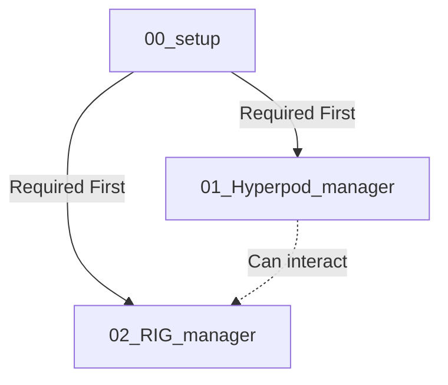

# 🛠️ HyperPod CLI Utilities (⚡ Experimental Preview)

> ⚠️ **IMPORTANT**: This is an experimental preview release of the HyperPod CLI utilities. Features and interfaces may change in future versions. Use with caution in production environments.

A collection of command-line utilities for managing HyperPod clusters and workloads. Each utility focuses on specific aspects of cluster management and job execution.

## ⚡ Preview Status

This experimental preview:

- Provides early access to HyperPod management features
- May undergo significant changes in future releases
- Welcomes feedback and feature requests
- Should be tested thoroughly before production use

## 📦 Available Modules

### 1. 🚀 Setup Manager (00_setup)

Initial setup and configuration of HyperPod clusters.

**When to use:**

- 🆕 Setting up a new HyperPod cluster
- 🔄 Configuring EKS integration
- 🛡️ Setting up initial security and networking

**Key Features:**

- 📋 CloudFormation stack creation
- 🔌 EKS cluster configuration
- 💾 Storage setup (EBS, FSx)
- 🌐 Network configuration

### 2. 💼 Job Manager (01_Hyperpod_manager)

Comprehensive job management and monitoring.

**When to use:**

- 📤 Submitting new training jobs
- 📊 Monitoring job progress
- 🔍 Viewing logs and metrics
- ⏹️ Managing running jobs

**Key Features:**

- 🤖 Multiple container support (SFT, DPO, PPO, etc.)
- 📈 CloudWatch integration
- 🎛️ Interactive job submission
- 📝 Job configuration management

### 3. 🎯 RIG Manager (02_RIG_manager)

Manage Restricted Instance Groups for controlled resource access.

**When to use:**

- 🏗️ Creating new instance groups
- ⚖️ Scaling existing groups
- 🗑️ Removing unused groups
- 🔧 Modifying group configurations

**Key Features:**

- 📦 Instance group creation
- 📏 Dynamic scaling
- 🔒 Security configuration
- 💽 Storage management

## 🔄 Workflow Dependencies



## 🎯 Quick Start Guide

1. **Initial Setup**

   ```bash
   cd 00_setup
   ./create_cfn_stack.sh
   ./create_hp_cluster.sh
   ```

2. **Job Management**

   ```bash
   cd 01_Hyperpod_manager
   ./hyperpod_job_manager.sh
   ```

3. **RIG Management**
   ```bash
   cd 02_RIG_manager
   python3 manage_rig.py <cluster-arn> --region <aws-region>
   ```

## 📋 Requirements

- 🔑 AWS CLI configured
- 🐍 Python 3.x
- 🛠️ kubectl
- ⚓ helm
- 🔧 jq

## 🔍 Module Selection Guide

Choose the appropriate module based on your task:

| Task                      | Module              | Command                   |
| ------------------------- | ------------------- | ------------------------- |
| 🆕 New Cluster Setup      | 00_setup            | `create_cfn_stack.sh`     |
| 📤 Submit Training Job    | 01_Hyperpod_manager | `hyperpod_job_manager.sh` |
| 📦 Manage Instance Groups | 02_RIG_manager      | `manage_rig.py`           |

## 🚦 Best Practices

1. **Order of Operations**

   - ✅ Always start with 00_setup for new clusters
   - ✅ Verify cluster health before job submission
   - ✅ Monitor resources before scaling RIGs

2. **Resource Management**

   - 📊 Monitor resource utilization
   - 💰 Clean up unused resources
   - 🔄 Regular configuration reviews

3. **Security**
   - 🔒 Follow least privilege principle
   - 🛡️ Regular security group reviews
   - 📝 Maintain access logs

## 🆘 Common Issues and Solutions

| Issue                     | Solution                | Module              |
| ------------------------- | ----------------------- | ------------------- |
| ❌ Cluster Creation Fails | Check IAM permissions   | 00_setup            |
| ⚠️ Job Submission Error   | Verify RIG availability | 01_Hyperpod_manager |
| 🔴 Scaling Issues         | Check subnet capacity   | 02_RIG_manager      |

## 📚 Additional Resources

- 📖 AWS HyperPod Documentation
- 🔧 EKS Best Practices
- 📊 CloudWatch Metrics Guide
- 🛡️ Security Guidelines

## 🤝 Support

For issues with specific modules:

- 🔧 Setup: Check 00_setup/README.md
- 💼 Jobs: Check 01_Hyperpod_manager/README.md
- 🎯 RIGs: Check 02_RIG_manager/README.md
