# Visual Content Regeneration & Virtual Try-On

A collection of sample notebooks demonstrating how to **expand, regenerate, and virtually try-on visual content** using the latest **Amazon Nova models** (**Nova Lite**, **Nova Canvas**, and **Nova Reel**).

## 🧠 Purpose

This project showcases practical code examples for applying **generative AI techniques to images and videos**, particularly focusing on:

- Text-guided image regeneration from a single food image
- Spatial and temporal expansion of images via outpainting and video synthesis
- Semantic-driven character generation from facial images
- Virtual try-on applications with food theme using Nova Canvas

By leveraging Amazon Nova models, each notebook explores a different use case of **visual content regeneration and manipulation**, helping you understand how to build rich, creative pipelines for image and video applications.

## 📁 Notebooks

```mermaid
graph TD
  %% Food Image Regeneration Flow
  A1[📷 Food Image] --> B1[🔤 Prompt Extraction]
  B1 --> C1[Nova Lite / Canvas → 🖼️ Text-to-Image]
  A1 --> D1[Nova Canvas → 🖼️ Image-to-Image]
  C1 --> E1[📄 Regenerated Food Image]
  D1 --> E1

  %% Outpainting + Video Generation Flow
  A2[📷 Image Input] --> B2[🖼️ Outpainting Masking]
  B2 --> C2[Nova Canvas → 🖼️ Extended Image]
  C2 --> D2[Nova Reel → 🎞️ Image-to-Video]
  D2 --> E2[📽️ Generated Video]

  %% Face to Persona Character Flow
  A3[🧑 Face Image] --> B3[🧠 Persona Inference]
  B3 --> C3[🧬 Trait-based Prompt]
  C3 --> D3[Nova Lite / Canvas → 🧙 Character Generation]
  D3 --> E3[🎨 AI Persona Image]

  %% Virtual Try-On Food Flow
  A4[🍽️ Empty Plate] --> B4[🍔 Food Reference]
  B4 --> C4[Nova Canvas → 🎯 Virtual Try-On]
  C4 --> D4[🔧 Multiple Merge Styles]
  D4 --> E4[🍽️ Food on Plate Result]
```

| Filename                                                                       | Description                                                                                                               |
|--------------------------------------------------------------------------------|---------------------------------------------------------------------------------------------------------------------------|
| [`01_image_regeneration.ipynb`](./01_image_regeneration.ipynb)                 | Generate new food images by extracting prompts from a single image and using text-to-image and image-to-image techniques. |
| [`02_image_to_video_expansion.ipynb`](./02_image_to_video_expansion.ipynb)     | Expand the visible region of an image using outpainting, then generate a smooth video using Nova Reel.                    |
| [`03_face_to_persona_generation.ipynb`](./03_face_to_persona_generation.ipynb) | Extract personality traits from a face and generate AI character portraits based on inferred persona.                     |
| [`04_virtual_try_on_food_theme.ipynb`](./04_virtual_try_on_food_theme.ipynb)   | Demonstrate Nova Canvas Virtual Try-On by placing food items (hamburger) on empty plates with multiple merge styles.     |

## 🧩 Use Cases

- AI-powered content creation
- Marketing and food photography automation
- Character-based storytelling
- Generative video synthesis from static inputs
- Virtual food placement and styling
- Restaurant menu visualization

## 📌 Requirements

- Amazon Bedrock access with Nova models enabled
- Python 3.10+
- Jupyter / IPython environment
