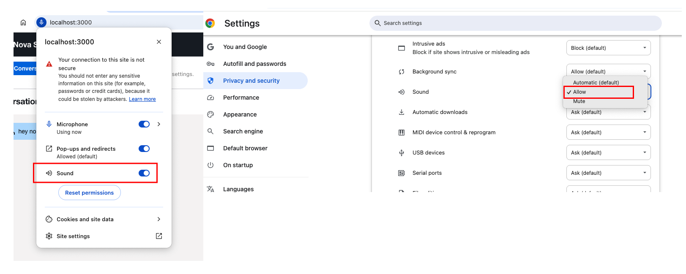
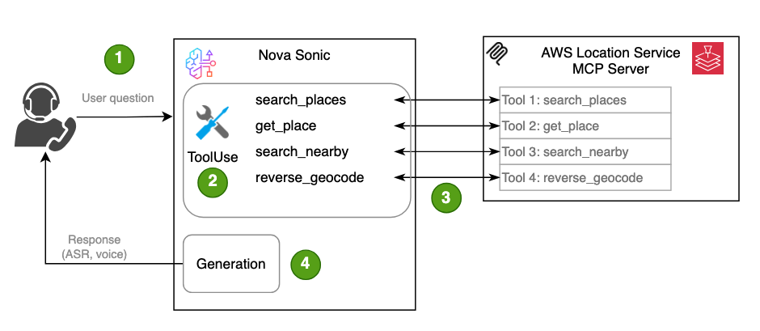
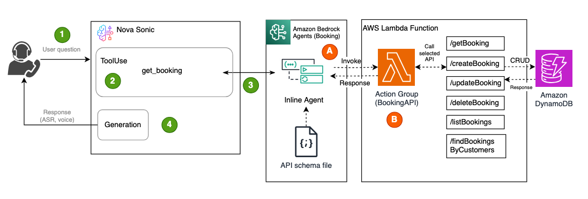

# Nova S2S workshop sample code

This project is for the [Amazon Nova Sonic speech-to-speech (S2S) workshop](https://catalog.workshops.aws/amazon-nova-sonic-s2s/en-US) and is intended for training purposes. It showcases a sample architecture for building applications that integrate with Nova Sonic, with features specifically designed to expose technical details for educational use.

For architectures that require an internet-exposed connection to serve mobile or web clients, the following approach is recommended:


The project includes two core components:
- A Python-based WebSocket server that manages the bidirectional streaming connection with Nova Sonic.
- A React front-end application that communicates with the S2S system through the WebSocket server.


## Repository Structure
```
nova-s2s-workshop/
├── python-server/                              # Python application serves web socket service and health check HTTP endpoint(optional)
│   ├── integration/
│   │   ├── bedrock_knowledge_bases.py          # Sample Bedrock Knowledge Bases implementation
│   │   ├── booking_openapi.json                # Bedrock Agents API definition
│   │   ├── inline_agent.py                     # Sample Bedrock Agents integration
│   │   ├── mcp_client.py                       # Sample MCP implementation
│   │   └── strands_agent.py                    # Sample Strands Agent implementation
│   ├── server.py                               # Main entry point: starts websocket and health check (optional) servers
│   ├── s2s_session_manager.py                  # Nova Sonic bidirectional streaming logic incapsulated
│   ├── s2s_events.py                           # Utlility class construct Nova Sonic events
│   ├── setup-for-ec2-lab.sh                    # Bash script for environment setup – intended for instructor-led labs only. Do not use for local deployments.
│   └── requirements.txt                        # Python dependencies
├── react-client/                               # Web client implementation
│   ├── src/
│   │   ├── components/
│   │   │   ├── eventDisplay.js                 # React component display event details
│   │   │   ├── meter.js                        # React component display metering information (tokens and cost)
│   │   ├── helper/
│   │   │   ├── audioHelper.js                  # Audio utility functions for encoding/decoding
│   │   │   └── s2sEvents.js                    # Utlility class construct Nova Sonic events
│   │   ├── static/                             # Images
│   │   ├── App.js                              # Define website layout and navigation
│   │   ├── index.js                            # Main entry point
│   │   └── s2s.js                              # Main entry point
│   ├── setup-for-ec2-lab.sh                    # Bash script for environment setup – intended for instructor-led labs only. Do not use for local deployments.
│   └── package.json                            # REACT manifest file
└── scripts                                     
    └── booking-resources.yaml                  # CloudFormation stack for Bedrock Agents sample deployment (optional)

```

### Prerequisites
- Python 3.12+
- Node.js 14+ and npm/yarn for UI development
- AWS account with Bedrock access
- AWS credentials configured locally
- In your AWS account, you can self-serve to gain access to the required model. Please refer to [this process](https://catalog.workshops.aws/amazon-nova-sonic-s2s/en-US/100-introduction/03-model-access) for guidance.
    - Titan text embedding v2
    - Nova Lite
    - Nova Micro
    - Nova Pro
    - Nova Sonic

## Installation instruction
Follow these instructions to build and launch both the Python WebSocket server and the React UI, which will allow you to converse with S2S and try out the basic features.

Clone the repository:
    
```bash
git clone https://github.com/aws-samples/amazon-nova-samples
mv amazon-nova-samples/speech-to-speech/workshops nova-s2s-workshop
rm -rf amazon-nova-samples
cd nova-s2s-workshop
```

### Install and start the Python websocket server
1. Start Python virtual machine
    ```
    cd python-server
    python3 -m venv .venv
    ```
    Mac
    ```
    source .venv/bin/activate
    ```
    Windows
    ```
    .venv\Scripts\activate
    ```

2. Install Python dependencies:
    ```bash
    pip install -r requirements.txt
    ```

3. Set environment variables:
    
    The AWS access key and secret are required for the Python application, as they are needed by the underlying Smithy authentication library.
    ```bash
    export AWS_ACCESS_KEY_ID="YOUR_AWS_ACCESS_KEY_ID"
    export AWS_SECRET_ACCESS_KEY="YOUR_AWS_SECRET"
    export AWS_DEFAULT_REGION="us-east-1"
    ```
    The WebSocket host and port are optional. If not specified, the application will default to `localhost` and port `8081`.
    ```bash
    export HOST="localhost"
    export WS_PORT=8081
    ```
    The health check port is optional for container deployment such as ECS/EKS. If the environment variable below is not specified, the service will not start the HTTP endpoint for health checks.
    ```bash
    export HEALTH_PORT=8082 
    ```
    
4. Start the python websocket server
    ```bash
    python server.py
    ```

> Keep the Python WebSocket server running, then run the section below to launch the React web application, which will connect to the WebSocket service.

### Install and start the REACT frontend application
1. Navigate to the `react-client` folder
    ```bash
    cd react-client
    ```
2. Install
    ```bash
    npm install
    ```

3. This step is optional: set environment variables for the React app. If not provided, the application defaults to `ws://localhost:8081`.

    ```bash
    export REACT_APP_WEBSOCKET_URL='YOUR_WEB_SOCKET_URL'
    ```

4. If you want to run the React code outside the workshop environment, update the `homepage` value in the `react-client/package.json` file from "/proxy/3000/" to "."

5. Run
    ```
    npm start
    ```

When using Chrome, if there’s no sound, please ensure the sound setting is set to Allow, as shown below.


⚠️ **Warning:** Known issue: This UI is intended for demonstration purposes and may encounter state management issues after frequent conversation start/stop actions. Refreshing the page can help resolve the issue.

## Repeatable patterns
This workshop includes [repeatable patterns](https://catalog.workshops.aws/amazon-nova-sonic-s2s/en-US/200-labs/02-repeatable-pattern) samples show case popular integrations including [Bedrock Knowledge Bases (RAG)](https://catalog.workshops.aws/amazon-nova-sonic-s2s/en-US/200-labs/02-repeatable-pattern/01-kb-lab), [MCP](https://catalog.workshops.aws/amazon-nova-sonic-s2s/en-US/200-labs/02-repeatable-pattern/02-mcp-lab), [Bedrock Agents](https://catalog.workshops.aws/amazon-nova-sonic-s2s/en-US/200-labs/02-repeatable-pattern/04-bedrock-agents), and [Strands Agent](https://catalog.workshops.aws/amazon-nova-sonic-s2s/en-US/200-labs/02-repeatable-pattern/03-strands). Some features require additional deployment steps if you're running the workshop in your own environment. Instructions for each feature are provided below.


### Bedrock Knowledge Base (RAG) intergation
This workshop includes a sample integration with [Amazon Bedrock Knowledge Bases](https://aws.amazon.com/bedrock/knowledge-bases/) to demonstrate RAG (Retrieval-Augmented Generation) based question answering. 

Refer to [this blog](https://aws.amazon.com/blogs/aws/knowledge-bases-now-delivers-fully-managed-rag-experience-in-amazon-bedrock/) if you're new to Amazon Bedrock Knowledge Bases and want to learn how to set one up using the AWS Console UI.

- To enable this feature, set your Knowledge Base ID as an environment variable. Specifying the Knowledge Base region is optional and only required if your Knowledge Base is running in a different region than Sonic.
    ```bash
    export KB_REGION='YOUR_KNOLEDGE_BASE_REGION_NAME'
    export KB_ID='YOUR_KNOWLEDGE_BASES_ID'
    ```

- Navigate to the `python-server` folder and Start the websocket server:
    ```bash
    python server.py
    ```
Then, use the sample UI to ask questions related to the data you've indexed into your Knowledge Base. 

For example, in the instructor-led workshop, a PDF of the [Amazon Nova User Guide](https://docs.aws.amazon.com/nova/latest/userguide/what-is-nova.html) was loaded, so you can ask questions like:
```
What is Amazon Nova Sonic?
```

Refer to [the RAG lab](https://catalog.workshops.aws/amazon-nova-sonic-s2s/en-US/200-labs/02-repeatable-pattern/01-kb-lab) for more detailed instruction.

### MCP integration

This workshop includes a sample integration with popular agentic frameworks such as [MCP](https://modelcontextprotocol.io/introduction) (Model Context Protocol). It uses the [AWS Location MCP server](https://github.com/awslabs/mcp?tab=readme-ov-file#aws-location-service-mcp-server) as an example, deployed in STDIO mode, to demonstrate direct tool invocation for answering location-related questions.



The following additional setup is required to try out the MCP instegration.

- Install uv from [Astral](https://docs.astral.sh/uv/getting-started/installation/)

- Ensure your AWS profile has the necessary permissions for Location Services, and set the profile name as an environment variable.
```bash
export AWS_PROFILE='YOUR_AWS_PROFILE'
```

- Navigate to the `python-server` folder and Start the websocket server:
```bash
python server.py --agent mcp
```

- You can then try asking questions using the sample UI such as:
```
Find me the location of the largest zoo in Seattle.

Find the largest shopping mall in New York City.
```

Refer to [the MCP lab](https://catalog.workshops.aws/amazon-nova-sonic-s2s/en-US/200-labs/02-repeatable-pattern/02-mcp-lab) for more detailed instruction.

### Bedrock Agents integration
This workshop includes a sample integration with [Bedrock Agents](https://docs.aws.amazon.com/bedrock/latest/userguide/agents.html) to showcase a booking scenario.
Follow the instructions below to try out the Bedrock Agents integration.



- Make sure the AWS CLI is installed. If not, follow the instructions [here](https://docs.aws.amazon.com/cli/latest/userguide/getting-started-install.html).

- Ensure your environment has the appropriate permissions to access the target AWS account, then run the command below.
    ```bash
    aws cloudformation deploy --template-file ./scripts/booking-resources.yaml --stack-name bedrock-agents --capabilities CAPABILITY_NAMED_IAM                 
    ```
    The CloudFormation template creates the following resources:

    1. DynamoDB Table (Bookings)
    2. IAM Role for Lambda (BookingLambdaRole)
    3. Lambda Function (BookingFunction)
    4. Lambda Permission for Bedrock
    5. Bedrock Execution Role (BedrockExecutionRole)

- The CloudFormation stack will output the Lambda function ARN, which needs to be set as the environment variable `BOOKING_LAMBDA_ARN` for the sample app to access it. Run the command below to retrieve the ARN and set the environment variable.

    ```bash
    export BOOKING_LAMBDA_ARN=$(aws cloudformation describe-stacks --stack-name bedrock-agents --query "Stacks[0].Outputs[?OutputKey=='BookingLambdaArn'].OutputValue" --output text)
    ```

- Navigate to the `python-server` folder and Start the websocket server:
    ```bash
    python server.py
    ```

- Now try out booking-related questions using the sample UI, for example:
```
Can you make a booking for John for May 25th at 7 p.m.?
Can you check if there are any bookings for John?
Can you update the booking to May 25th at 7:30 p.m.?
Can you cancel the booking?
```

Refer to [the Bedrock Agents lab](https://catalog.workshops.aws/amazon-nova-sonic-s2s/en-US/200-labs/02-repeatable-pattern/04-bedrock-agents) for more detailed instructions.

### Strands Agent integration
This workshop demonstrates how to use a [Strands Agent](https://community.aws/content/2xCUnoqntk2PnWDwyb9JJvMjxKA/step-by-step-guide-setting-up-a-strands-agent-with-aws-bedrock)  to orchestrate external workflows, integrating [AWS Location MCP server](https://github.com/awslabs/mcp?tab=readme-ov-file#aws-location-service-mcp-server) and a sample Weather tool, showcasing advanced agent reasoning and orchestration.


The following additional setup is required to try out the Strands Agent integration.

- Install uv from [Astral](https://docs.astral.sh/uv/getting-started/installation/)

- Ensure your AWS profile has the necessary permissions for Location Services, and set the profile name as an environment variable.
```bash
export AWS_PROFILE='YOUR_AWS_PROFILE'
```

- Navigate to the `python-server` folder and Start the websocket server:
```bash
python server.py --agent strands
```
- You can then try asking questions using the sample UI such as:
```
What’s the weather like in Seattle today?
```

Refer to [the Strands Agent lab](https://catalog.workshops.aws/amazon-nova-sonic-s2s/en-US/200-labs/02-repeatable-pattern/03-strands) for more detailed instructions.