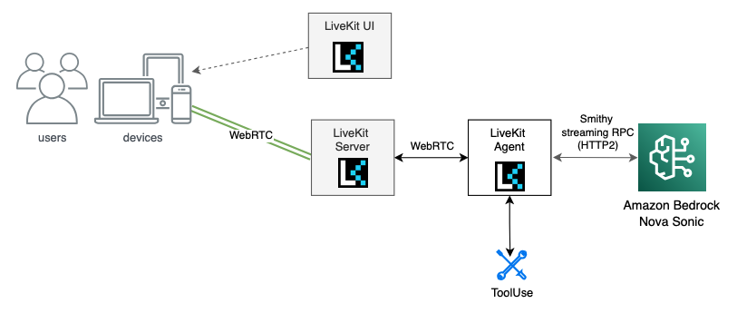
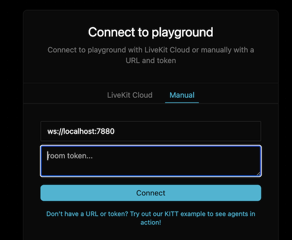
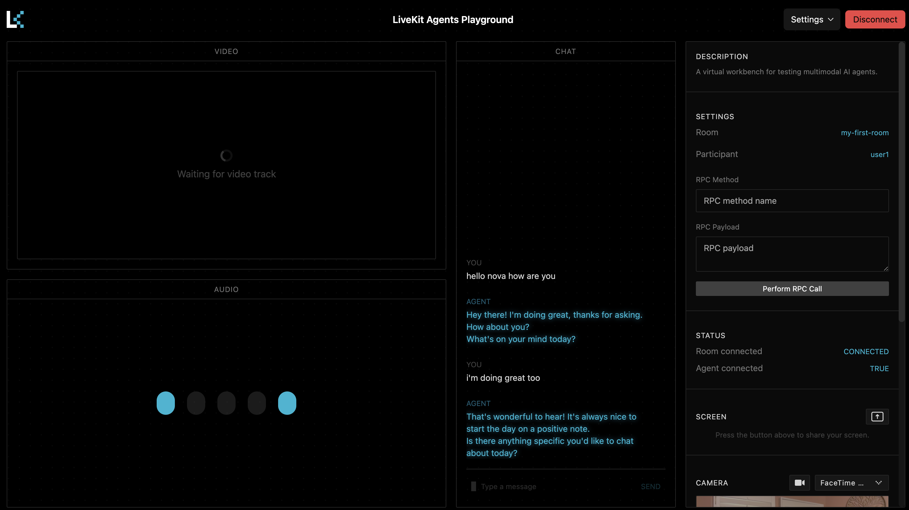

# Nova Sonic with LiveKit

[LiveKit](https://livekit.io/?utm_source=aws&utm_medium=blog&utm_campaign=nova_sonic_plugin) is an open source platform for building voice, video, and physical AI applications that can see, hear, and speak. 

Building real-time, voice-first AI apps requires managing complex infrastructure—from audio capture and streaming to signaling, routing, and latency optimization—especially when using bidirectional models like Amazon Nova Sonic. To simplify this, we integrated a [Nova Sonic plugin](https://docs.livekit.io/agents/integrations/realtime/nova-sonic/?utm_source=aws&utm_medium=blog&utm_campaign=nova_sonic_plugin) into LiveKit’s Agents framework, eliminating the need to manage custom pipelines or transport layers. LiveKit handles real-time audio routing and session management, while Nova Sonic provides speech understanding and generation. Developers get features like full-duplex audio, voice activity detection, and noise suppression out of the box, so they can focus on designing a great user experience for their AI voice applications.

LiveKit offers high level SDKs to serve the WebRTC server which 
In this lab, we’ll use the LiveKit Agent Playground UI to test the LiveKit Sonic integration. We'll launch the following components:

1. LiveKit Server – A server launched from an open-source library that enables WebRTC communication over the internet.

2. LiveKit Agent (Python) – A custom Python agent that integrates with Nova Sonic. This is the component that will require customized implementation.

3. LiveKit UI – The default LiveKit agent playground is an open-source web application. In this lab, we’ll use the hosted version, but you can also deploy and customize your own using the available [source code on GitHub](https://github.com/livekit/agents-playground/).




In this lab, steps 1 and 3 use open-source components that can be launched out of the box. The only step that requires coding is step 2, where you customize the LiveKit Agent. The source code is available on [GitHub](https://github.com/aws-samples/amazon-nova-samples/blob/main/speech-to-speech/workshops/livekit/agent.py)

## Launch the components
Open a terminal and run the below command to install the dependencies

```bash
cd livekit
# Install UV
curl -LsSf https://astral.sh/uv/install.sh | sh

# Start virtual environemnt 
python3 -m venv .venv
# Mac/Linux
source .venv/bin/activate
# Windows
.venv\Scripts\activate

# install dependencies
pip install --upgrade pip
pip install -r requirements.txt
``` 

### Launch the LiveKit Server
Start the LiveKit server:
```bash
livekit-server --dev
```

Keep the terminal and LiveKit server running—we’ll launch the LiveKit Agent next.

### Launch the LiveKit Agent
Open a new terminal, navigate to the LiveKit folder and activate the virtual environment:

```bash
cd livekit
source .venv/bin/activate
``` 

Set the LiveKit API key and secret as environment variables. For the development environment, we’ll use the default `devkey` and `secret` values.

```bash
export LIVEKIT_API_KEY=devkey
export LIVEKIT_API_SECRET=secret
```

Set AWS credentials to environment vairables:
```bash
export AWS_ACCESS_KEY_ID=<aws access key id>
export AWS_SECRET_ACCESS_KEY=<aws secret access key>
# if using a permanent identity (e.g. IAM user)
# then session token is optional
export AWS_SESSION_TOKEN=<aws session token>
```

Then run the below command to start the LiveKit Agent. Source code located at [here](./agent.py).
```bash
uv run python agent.py connect --room my-first-room
```

### Launch the LiveKit sandbox UI

- First, Open the URL in a new tab in the browser [https://agents-playground.livekit.io/](https://agents-playground.livekit.io/).

- Choose *Manual* tab.



- In the first text field, enter the LiveKit server HTTP URL which we launched in the previous step: `ws://localhost:7880`.

- We now need to get a LiveKit Token to access the sandbox UI. Leave the previous two terminal open and open an new terminal. And run the follow command:

    ```bash
    lk token create \
    --api-key devkey --api-secret secret \
    --join --room my-first-room --identity user1 \
    --valid-for 24h
    ```

    You will receive an access token in the command line, similar to the example below.
    ```
    valid for (mins):  1440
    Token grants:
    {
    "roomJoin": true,
    "room": "my-first-room"
    }

    Access token: YOUR_ACCESS_TOKEN_MORE_THAN_200_CHARACTERS
    ```

- Copy the access token from the output and paste it to the *room token* field.
- Choose *Connect*.
    You are now connected to Sonic via the LiveKit Sandbox UI. You can start a conversation with Sonic at any time.

    

> If you’re disconnected from the LiveKit room, you will have to restart the agent process (agent.py) to talk to Amazon Nova Sonic again. 

## Launch the LiveKit agent with tool
The workshop includes [a second example](./agent-tool.py) that demonstrates how to define tools in a LiveKit agent.

We’ll keep the LiveKit server running and restart the LiveKit Agent to switch to a different file.

```bash
uv run python agent-tool.py connect --room my-first-room
```

- Refresh the LiveKit Playground tab and reconnect in Manual mode.

- You can now chat with Sonic and ask weather-related questions such as:
```
How's the weather in Seattle today?
```