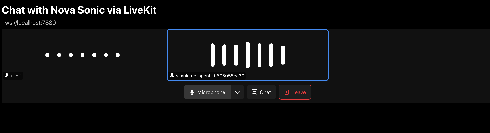

# Nova Sonic with LiveKit

[LiveKit](https://livekit.io/?utm_source=aws&utm_medium=blog&utm_campaign=nova_sonic_plugin) is an open source platform for building voice, video, and physical AI applications that can see, hear, and speak. Amazon Nova Sonic now supports integration with LiveKit through a [Nova Sonic plugin](https://docs.livekit.io/agents/integrations/realtime/nova-sonic/?utm_source=aws&utm_medium=blog&utm_campaign=nova_sonic_plugin). 

To launch a full-stack application that communicates with Nova Sonic via LiveKit, the following components are required. This workshop will guide you through deploying these components using various options—serving as a jumpstart for builders looking to create LiveKit-powered applications that interact with Nova Sonic.

1. LiveKit Server – A server launched from an open-source library that enables WebRTC communication over the internet.

2. LiveKit Agent (Python) – A custom Python agent that integrates with Nova Sonic. This is the component that will require customized implementation.

3. LiveKit UI
    - The default LiveKit agent playground is an open-source web application. In this lab, we’ll use the hosted version, but you can also deploy and customize your own using the available [source code on GitHub](https://github.com/livekit/agents-playground/).
    - The sample code also includes a lightweight React web application that serves as an example of a customized LiveKit UI under the `ui` folder.


## Install LiveKit
Clone the repository — skip this step if you’ve already cloned the code by following the instructions in the parent folder.

```bash
git clone https://github.com/aws-samples/amazon-nova-samples
mv amazon-nova-samples/speech-to-speech/workshops nova-s2s-workshop
rm -rf amazon-nova-samples
cd nova-s2s-workshop/livekit
```

Install Homebrew — skip this step if it’s already installed. 
> Note that this command is for x86 architecture; if you're using an ARM-based system, you may need to find alternative instructions.
```bash
if command -v brew >/dev/null 2>&1; then
    echo "Homebrew is installed."
else
    sudo dnf groupinstall "Development Tools" -y
    sudo dnf install curl file git gcc bzip2 tar -y
    echo | /bin/bash -c "$(curl -fsSL https://raw.githubusercontent.com/Homebrew/install/HEAD/install.sh)"
    eval "$(/home/linuxbrew/.linuxbrew/bin/brew shellenv)"
    source ~/.bashrc
fi
```

Install LiveKit and CLI
```bash
brew install livekit livekit-cli
```

Install UV
```bash
curl -LsSf https://astral.sh/uv/install.sh | sh
```

### Launch the LiveKit Server
Run the below command to start a LiveKit Server
```bash
livekit-server --dev
```
By default, the LiveKit server will be available via port 7880 (Websocket) and port 7881,7882 (WebRTC).

Keep the terminal with LiveKit server running — we’ll launch the LiveKit Agent next.

### Launch the LiveKit Agent
Open a new terminal, navigate to the LiveKit folder. 

```bash
cd nova-s2s-workshop/livekit
```

Then start a Python virtual environemnt and install dependencies:
```bash
python3 -m venv .venv
source .venv/bin/activate

pip install --upgrade pip
pip install -r requirements.txt
```

Set the LiveKit API key and secret as environment variables. For the development environment, you can use the default `devkey` and `secret` values.

```bash
export LIVEKIT_API_KEY=devkey
export LIVEKIT_API_SECRET=secret
```

Set AWS credentials to environment vairables:
> session token is optional if using a permanent identity (e.g. IAM user)
```bash
export AWS_ACCESS_KEY_ID=<aws access key id>
export AWS_SECRET_ACCESS_KEY=<aws secret access key>
export AWS_SESSION_TOKEN=<aws session token>
```

Run the below command to start the LiveKit Agent. Source code located at [here](./agent.py).
```bash
uv run python agent.py connect --room my-first-room
```

### Launch the hosted LiveKit playground UI

- First, Open the URL in a new tab in the browser [https://agents-playground.livekit.io/](https://agents-playground.livekit.io/).

- Choose *Manual* tab.


- In the first text field, enter the LiveKit server HTTP URL which we launched in the previous step: `ws://localhost:7880`.

- Run the following command in a new terminal. It will print out a LiveKit token valid for 24 hours.
    ```bash
    cd nova-s2s-workshop/livekit

    source .venv/bin/activate
    eval "$(/home/linuxbrew/.linuxbrew/bin/brew shellenv)"

    lk token create \
    --api-key devkey --api-secret secret \
    --join --room my-first-room --identity user1 \
    --valid-for 24h
    ```

- Copy the access token from the output and paste it to the *room token* field (2nd field).
- Choose *Connect*.
    You are now connected to Sonic via the LiveKit Sandbox UI. You can start a conversation with Sonic at any time.

    

> If you’re disconnected from the LiveKit room, you will have to restart the agent process (agent.py) to talk to Amazon Nova Sonic again. 

## Launch the LiveKit agent with tool
The workshop includes [a second example](./agent-tool.py) that demonstrates how to define tools in a LiveKit agent.

We’ll keep the LiveKit server running and restart the LiveKit Agent to switch to a different file.

```bash
uv run python agent-tool.py connect --room my-first-room
```

The LiveKit Playground should automatically connect to the newly launched agent with a different voice. If not, refresh the LiveKit Playground page and reconnect in Manual mode.

You can now chat with Sonic and ask weather-related questions such as:
```
How's the weather in Seattle today?
```

## Use the customized LiveKit UI
The workshop includes [a customized REACT web application](./ui) that servered as a quickstart when you need to build your own UI.

In the folder `nova-s2s-workshop/livekit` navigate to the `ui` folder:
```bash
cd nova-s2s-workshop/livekit/ui
```

Run the command below to save the LiveKit server URL and access token to a `.env` file for the React application to access.
```bash
eval "$(/home/linuxbrew/.linuxbrew/bin/brew shellenv)"

OUTPUT=$(lk token create \
  --api-key devkey --api-secret secret \
  --join --room my-first-room --identity user1 \
  --valid-for 24h)

LIVEKIT_TOKEN=$(echo "$OUTPUT" | sed -n 's/^Access token: //p')

echo "REACT_APP_LIVEKIT_SERVER_URL=ws://localhost:7880" > .env
echo "REACT_APP_LIVEKIT_TOKEN=$LIVEKIT_TOKEN" >> .env
```

Install REACT dependencies and start the app:
```bash
npm install
npm start
``` 
The customized UI application will be opened in a new tab in the browser. It adopted a simple design that you can easily extend to suit your own needs.

